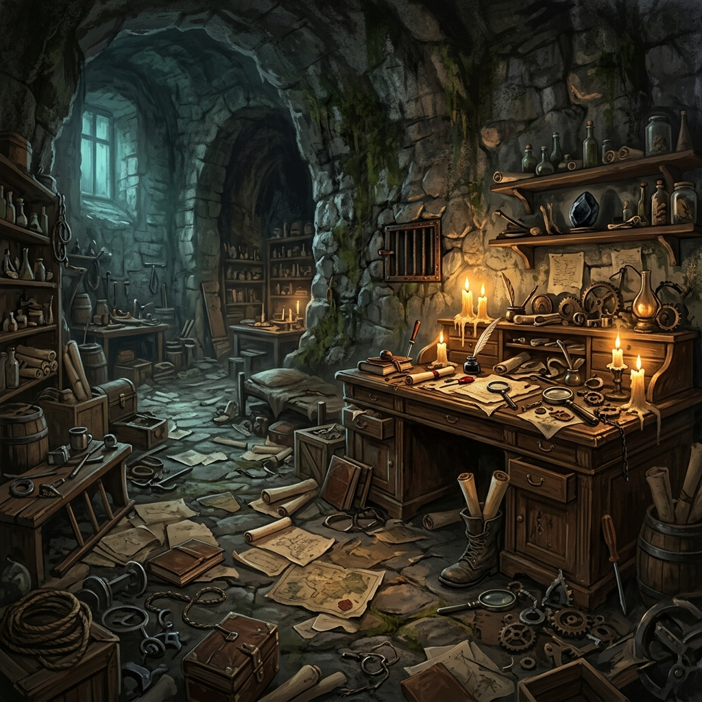

# O Enigma de Xylo

<p align="center">
  
</p>

<p align="center">
  Escape room cooperativo para navegador, criado para ampliar a imersão de uma campanha de RPG de mesa.
</p>

## Sobre o projeto

O Enigma de Xylo transforma o esconderijo de um alquimista em um cenário point-and-click interativo. Os jogadores exploram a sala, encontram ferramentas, combinam itens e resolvem uma sequência de enigmas enquanto suas descobertas são compartilhadas com o grupo.

O projeto combina manipulação de DOM, renderização 3D, efeitos em Canvas e comunicação P2P diretamente no navegador.

## Principais recursos

- cenário interativo com hotspots posicionados sobre a arte;
- inventário dividido entre ferramentas, pistas e recompensas;
- sequência de enigmas baseada na coleta e combinação de itens;
- inspeção e rotação de objetos em 3D;
- lupa e lanterna com efeitos visuais sobre o cenário;
- diário de ações compartilhado entre os participantes;
- sessões multiplayer P2P sem backend próprio;
- interface responsiva para diferentes tamanhos de tela.

## Tecnologias


## Fluxo do jogo

1. O jogador escolhe sua identidade no lobby.
2. O grupo explora o laboratório por meio dos pontos de interesse.
3. Ferramentas e pistas são adicionadas ao inventário.
4. Alguns objetos precisam ser combinados ou usados no local correto.
5. As descobertas são registradas no diário compartilhado da sessão.

## Executar localmente

O projeto é estático e não exige instalação de dependências.

### Windows

```powershell
.\serve.ps1
```

Depois, acesse `http://localhost:8080`.

### Python

```bash
python -m http.server 8080
```

Depois, acesse `http://localhost:8080`.

> Abra o projeto por um servidor HTTP. Alguns recursos do navegador não funcionam corretamente quando o `index.html` é aberto diretamente pelo sistema de arquivos.

## Estrutura principal

```text
.
|-- index.html          # Estrutura da interface e regras de interação
|-- assets/             # JavaScript, CSS e recursos do build
|-- serve.ps1           # Servidor HTTP local para Windows
|-- COMO_JOGAR.md       # Mecânicas e arquitetura do jogo
`-- netlify.toml        # Configuração de publicação estática
```

## Estado atual

O projeto é um protótipo funcional em evolução. A experiência principal, o inventário e a sequência de enigmas estão implementados; o balanceamento e a validação do fluxo multiplayer ainda podem receber melhorias.

Para conhecer os detalhes das mecânicas, consulte [COMO_JOGAR.md](./COMO_JOGAR.md).

## Autor

Desenvolvido por [Leandro Santos](https://github.com/LeandroSatsuki).
